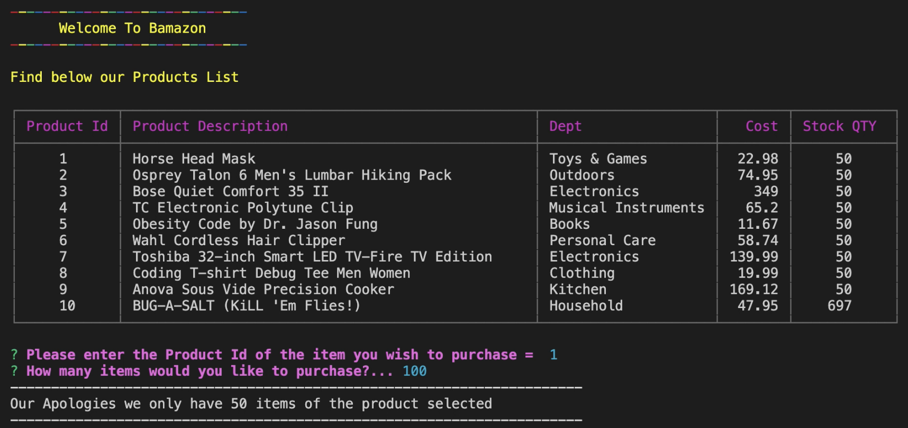
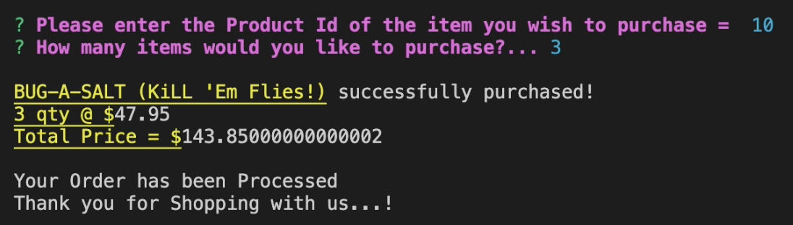
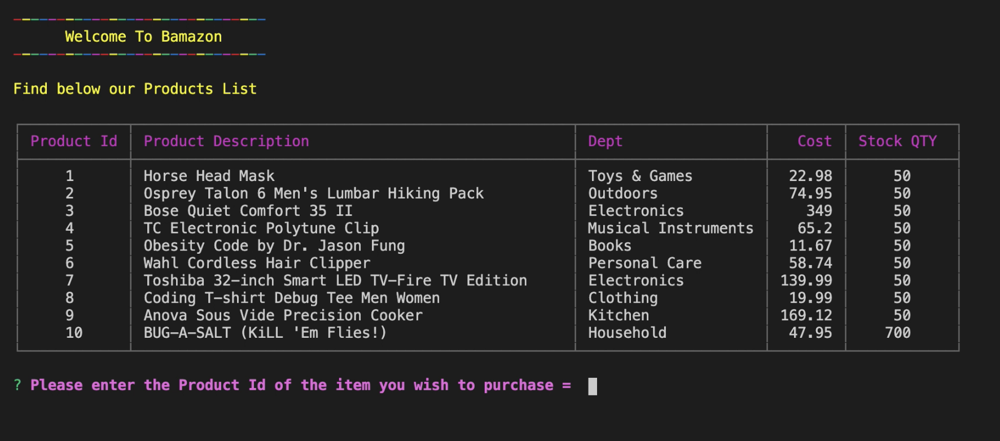

# Homework - Bamazon!

Amazon-like storefront using Node.js & MySQL.  The app will take in orders from customers and deplete stock from the store's inventory. 

## Screenshots

### Prerequisites

Make sure you save and require the MySQL and Inquirer npm packages in the folder.

## Deployment

Use terminal or run from Visual Studio Code Terminal

Type:  node bamazon.js

## Built With
*Visual Studio Code
*Workbench
*MySQL 
*Inquirer 

## Contributing
Solo project

## Version
This would be the only version for now. 

## Authors

John Carlo Base

## Acknowledgments

* Hat tip to anyone whose code was used
* Inspiration: Elon Musk

